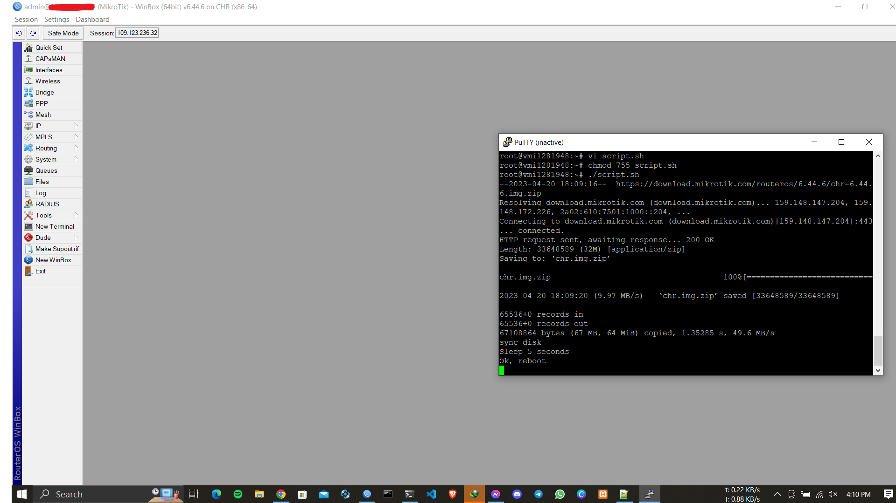

# Mikrotik-CHR
This script can be used to install MicroTik operating system version 22.04 and it can be used as a MicroTik cloud hosted router.


## Note

- If your VPS server does not have the Ethernet port set to "eth0" and the disk name set to "/dev/sda" , then you will need to make some changes to this script.
- 

# **Installation** :
copy the command below, paste in your terminal, then put your password, wait for your PC to restart and you will already be a PRO user of Zorin OS

```bash
git clone git@github.com:nymurbd/Mikrotik-CHR.git && cd Mikrotik-CHR && chmod 755 script.sh && sudo ./script.sh

```
